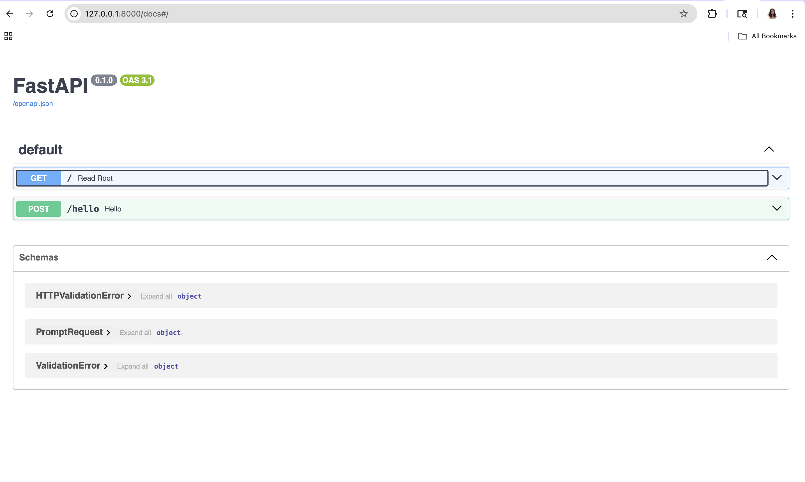

# Building a Simple LLM API Service

## About
**Name:** Anupama
**Bronco ID ** 018189912
**Project:** A lightweight API service that takes a user's prompt, sends it to an LLM (Large Language Model), and returns the generated response — all built using FastAPI.

## Project Structure

```
llm_api/
├── app.py              # Main application file
├── requirements.txt    # Python dependencies
```

## Getting Started

Here's how to set up and run the project on your machine:

**1. Set up a virtual environment**

```bash
python -m venv venv
source venv/bin/activate
```

**2. Install the required packages**

```bash
pip install -r requirements.txt
```

**3. Add your OpenAI API key**

```bash
export OPENAI_API_KEY="your-api-key"
```

**4. Fire up the server**

```bash
uvicorn app:app --reload
```

**5. Check it out in your browser**

Head over to `http://127.0.0.1:8000/docs` to see the interactive Swagger UI where you can test the API directly.

## What the API Does

 Method | Endpoint | What it does 

| GET    | `/`      | A simple root route — just to confirm the server is alive |
| POST   | `/hello` | Takes a prompt and returns the LLM's response |

## Trying It Out

You can test the `/hello` endpoint using curl:

```bash
curl -X POST http://127.0.0.1:8000/hello \
  -H "Content-Type: application/json" \
  -d '{"prompt":"Hello"}'
```

And here's what a typical response looks like:

```json
{
  "input": "Hello",
  "llm_output": "Hi! How can I help you today?"
}
```

## What I Implemented

- **REST API with FastAPI** — Clean and fast API framework with automatic docs generation
- **Input validation using Pydantic** — The prompt field must be a non-empty string (whitespace-only inputs are also rejected with a 422 error)
- **OpenAI LLM integration** — The API connects to OpenAI's model to generate responses
- **Safe error handling** — If something goes wrong with the LLM call, the API returns a generic error message (HTTP 500) without exposing any internal details

## Screenshots


# llm_api
